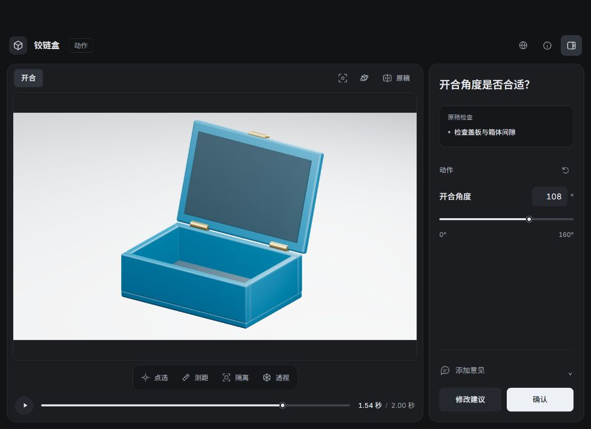

# Blender2Easy

[](https://github.com/Jack-ItsMe/Blender2Easy/actions/workflows/ci.yml)

**用 Blender 制作，和 Agent 一起看清、调准。**

[English](README.md) · [快速开始](docs/getting-started.zh-CN.md) · [使用示例](docs/examples.md) · [参与贡献](CONTRIBUTING.zh-CN.md)

Blender2Easy 是一套面向 Agent 的技能和本地工具，用于创建、修改三维物件及展示动画。Agent 在 Blender 中准备场景；需要你判断外形、动作、镜头或成片时，再打开一个聚焦当前问题的 Three.js 预览工作区。

你可以指出具体部件、对照参考图，或调整当前开放的少量参数。Agent 读取这些位置和意见，核验修改后继续制作。

**版本 0.10.2 · 早期版本 · Blender/浏览器工作流已在 Windows 验证；Linux 单元及 MCP 检查由 CI 覆盖；macOS 尚未验证。**



*界面演示使用预先准备的示例场景。浏览器画面不是 Blender 最终渲染，也不代表自动还原产品的能力证明。*

## 可以做什么

| 能力 | 具体用途 |
| --- | --- |
| 聚焦当前问题的预览 | 确认模型、动画段落、构图或成片。Agent 指定问题、初始视角和可调参数。 |
| 精准定位反馈 | 标记可见表面或参考图；在当前任务允许时，使用两点测量、部件隔离和透视查看。支持的预览网格可吸附到顶点和边。 |
| 参考与结构检查 | 对照参考图、读取求值后的场景快照，检查明确声明的连接、铰链及修订保留项，并将结果关联到预览位置。 |
| 新建或沿用资产 | 使用原生 `.blend`、确定性的 Blender 脚本，或用于简单组合模型的 JSON；保留有用的现有资产。 |
| 可恢复的制作流程 | 复用有效帧，补渲染缺失或失效帧，编码并完整解码检查视频，导出声明的项目资产与哈希记录。 |
| 简洁的界面 | 大画布、按需出现的工具，深色/浅色/跟随系统主题，以及简体中文、繁体中文和英文界面。 |

基本流程是：**提出要求 → Agent 准备 → 局部预览与反馈 → Agent 应用 → Blender 渲染**。需要视觉判断时才打开预览，不要求你参与每一步制作。

## 开始使用

需要一个能够读取技能、操作文件和执行 Python/Blender 命令的本地 Agent 宿主。**本文档以 Codex 为安装目标。** 其他宿主可以接入 CLI 或可选 MCP，但本项目尚未验证这些宿主的完整集成。

还需要 Python、Blender、支持 WebGL 的浏览器，以及下面的 Python 依赖。视频输出需要 FFmpeg，`imageio-ffmpeg` 可以提供其可执行文件。安装依赖和后续 Agent 命令应使用同一个 Python 环境。

在你存放源码的目录中执行：

```sh
git clone https://github.com/Jack-ItsMe/Blender2Easy.git
cd Blender2Easy
python -m pip install -r skills/blender2easy/scripts/requirements.txt
python skills/blender2easy/scripts/animation.py doctor
python scripts/install.py
```

`doctor` 只检查依赖，不会安装软件。出现 `MISSING_DEPENDENCIES` 时，先解决依赖再渲染。安装脚本将技能复制到 Codex 的技能目录，路径和手动安装方式见[快速开始](docs/getting-started.zh-CN.md)。

在能够发现已安装技能的 Codex 对话中尝试：

> 使用 $blender2easy 制作一段带铰链的盒子打开的短动画。先准备模型和动作。需要我判断时，只打开角度和停留时间的局部预览。最终出视频前，先渲染预览画面。

也可以先独立看看预览界面：

```sh
python skills/blender2easy/scripts/animation.py init work/box-demo --template box
python skills/blender2easy/scripts/animation.py editor work/box-demo/project.json --open
```

保持服务运行。没有 Agent 创建的调整任务时，默认页面只供查看。`box` 和 `lamp` 是入门模板，不限制 Agent 在 Blender 中创作其他物件。

## 当前边界

- **Three.js 用于预览检查。** 材质、插值和测量可能与 Blender 不同。吸附针对受支持的可见预览网格，不是 CAD 的解析几何。最终外观与动作仍需检查 Blender 输出。
- **诊断只核验明确声明的条件。** 它不会自动推断正确机械结构，也不能保证无碰撞或仅凭照片精确还原产品。
- **提交反馈保存的是提案。** 它不会直接把候选效果写入项目或启动渲染。Agent 本轮结束后，需要回到对话说“继续”；网页反馈不能自动唤醒 Agent。
- **复杂修改仍在 Blender 中完成。** 浏览器不能完整复现或编辑任意材质节点、骨骼、物理和合成器行为。
- **本地工具不等于本地大模型。** 预览服务只监听本机，界面资源从本地加载；Agent 宿主和模型的网络、数据处理及费用由其自身决定。外部资产服务也有独立的访问与许可要求。

## 深入了解

- [安装与常见问题](docs/getting-started.zh-CN.md)
- [中英文提示词与可复现模板示例](docs/examples.md)
- [CLI 命令](skills/blender2easy/references/workflow.md)
- [反馈契约](skills/blender2easy/references/review.md)与[预览行为](skills/blender2easy/references/editor.md)
- [结构诊断](skills/blender2easy/references/diagnostics.md)、[质量工具](skills/blender2easy/references/quality-tools.md)和[可选 MCP](skills/blender2easy/references/mcp.md)

## 一起改进 Blender2Easy

可以从改清楚一条安装说明、补一个小示例，或报告自己设备上的使用结果开始。项目仍在早期，小而可复现的贡献很有帮助。

- [适合首次贡献的任务](https://github.com/Jack-ItsMe/Blender2Easy/issues?q=is%3Aissue%20is%3Aopen%20label%3A%22good%20first%20issue%22)：范围明确的文档与示例工作。
- [需要协助的任务](https://github.com/Jack-ItsMe/Blender2Easy/issues?q=is%3Aissue%20is%3Aopen%20label%3A%22help%20wanted%22)：平台验证和预览体验检查。
- [社区讨论](https://github.com/Jack-ItsMe/Blender2Easy/discussions)：使用答疑、方向讨论和示例分享。
- [中文贡献指南](CONTRIBUTING.zh-CN.md) · [English guide](CONTRIBUTING.md)：Fork 仓库、完成小范围改动、提交 PR。

较大改动先在 Issue 中讨论范围。报告结果时，请区分浏览器预览、真实 Blender 渲染和自动测试。

## 致谢

Blender2Easy 改编和集成了 Bars 的 [Blender Agent Studio](https://github.com/ifBars/blender-agent-studio) 专项工作流及工具，基于提交 [`748b18b`](https://github.com/ifBars/blender-agent-studio/tree/748b18ba4cbb5df6fc1da854e00e4c3526fdd128)。保留的署名、上游文件哈希与本地改动记录见 [PROVENANCE.json](skills/blender2easy/vendor/bas/PROVENANCE.json)。

预览使用 Three.js 和随包分发的界面字体，各组件许可见[第三方声明](skills/blender2easy/THIRD_PARTY_NOTICES.md)。Blender2Easy 是独立项目，与 Blender Foundation 无隶属或背书关系。

Blender2Easy 原创代码采用 [MIT 许可证](LICENSE)，随包组件保留各自声明。
