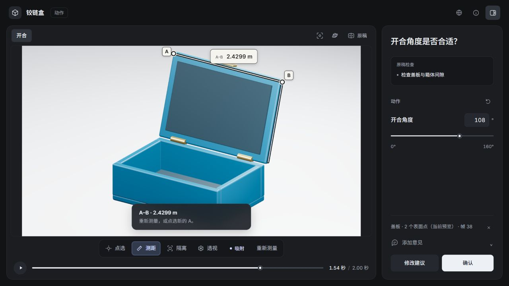

# Examples

[Back to README](../README.md) · [中文首页](../README.zh-CN.md)

These are starting prompts and reproducible workflows, not guarantees about a model's output. Supply the relevant asset paths, reference images and delivery requirements. The agent's model, input quality and visual review still affect the result.

## A small first animation / 第一个动画

> Use $blender2easy to make a short hinged-box opening animation. Prepare the initial model and motion, then ask me to judge just the opening angle and pause in a focused review. Check a few Blender frames before rendering the video.

> 使用 $blender2easy 做一段带铰链的盒子打开动画。先准备模型和动作，再通过局部预览让我判断打开角度和停留时间。先检查几帧 Blender 画面，再出视频。

The bundled `box` template has an `opening` shot with 48 output frames. To reproduce the template pipeline from the repository root:

```sh
python skills/blender2easy/scripts/animation.py init work/box-demo --template box
python skills/blender2easy/scripts/animation.py validate work/box-demo/project.json
python skills/blender2easy/scripts/animation.py preview work/box-demo/project.json --shot opening --frames 1,24,48
python skills/blender2easy/scripts/animation.py run work/box-demo/project.json --shot opening
python skills/blender2easy/scripts/animation.py verify work/box-demo/project.json --shot opening
```

If you already created `work/box-demo`, skip `init` or choose a new directory. Inspect the paths in the JSON command output. This demonstrates a prepared template and the production pipeline; it does not test reconstruction from a reference image.

## Refine an existing asset / 修改已有资产

> Use $blender2easy with the attached .blend. Preserve its geometry and materials. Prepare a camera review so I can compare a front view and a three-quarter view, then render the chosen shot. Report any missing linked resources before dependent work.

> 使用 $blender2easy 处理我提供的 .blend，保留几何和材质。准备镜头预览，让我比较正面与四分之三视角，再渲染选定镜头。如有缺失的链接资源，请在相关制作前说明。

Native Blender scenes use a GLB for browser inspection. Complex shader, rig and simulation behavior may need Blender preparation or baking. The agent should not promise a live control for an unsupported edit.

## Match structure before polish / 先核对结构，再打磨外观

> Use $blender2easy to model the object in these references. Identify visible part relationships and mark dimensions that are inferred. Compare the important poses with matching camera views before refining materials. If a hinge is ambiguous, prepare a focused reference review.

> 使用 $blender2easy 根据这些参考图建模。先识别可见部件关系，并注明推测的尺寸。在打磨材质前，对照相同视角和关键姿态检查结构。铰链关系不明确时，准备聚焦这一处的参考预览。

Reference tools can help inspect discrepancies. They do not automatically recover hidden geometry or establish an object's correct mechanism.

## Point out a local problem / 指出局部问题

> In the current review, let me mark the two endpoints around this gap and attach the measurement to my feedback. Keep the rest of the model unchanged. Use Blender evidence to verify any dimensional claim before applying a correction.

> 在当前预览中，让我标记这个间隙的两个端点，把测量和意见一起交给你。其他部分保持不变。任何尺寸结论请在修改前用 Blender 数据核验。



*Prepared interface demonstration. Browser measurements are unverified preview annotations. Snapping follows supported visible preview geometry and is not CAD metrology.*

## Resume a render / 继续中断的渲染

> Use $blender2easy to continue this existing project. Read its status and recorded outputs first, reuse frames whose inputs remain valid, render what is missing, and verify the resulting video. Report the actual output paths.

> 使用 $blender2easy 继续这个已有项目。先检查状态和交付记录，复用输入仍有效的帧，补齐缺失部分并核验视频，返回实际输出路径。

For the template project:

```sh
python skills/blender2easy/scripts/animation.py status work/box-demo/project.json
python skills/blender2easy/scripts/animation.py run work/box-demo/project.json --shot opening
python skills/blender2easy/scripts/animation.py verify work/box-demo/project.json --shot opening
```

Cache reuse depends on unchanged inputs and valid files. The toolkit does not promise a fixed speedup, token reduction or render duration.
